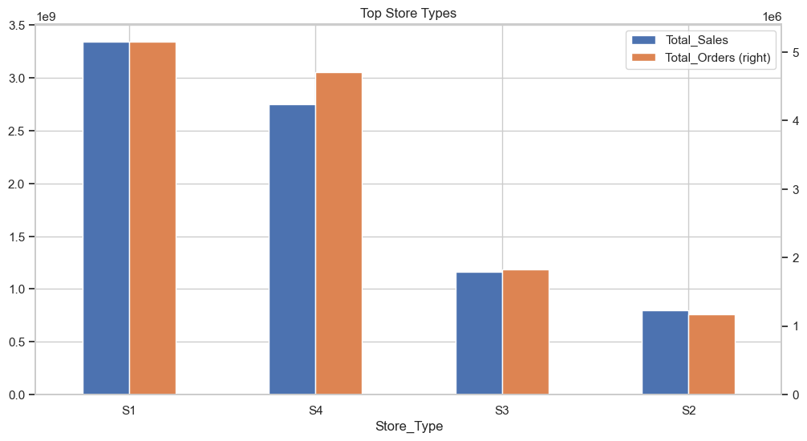
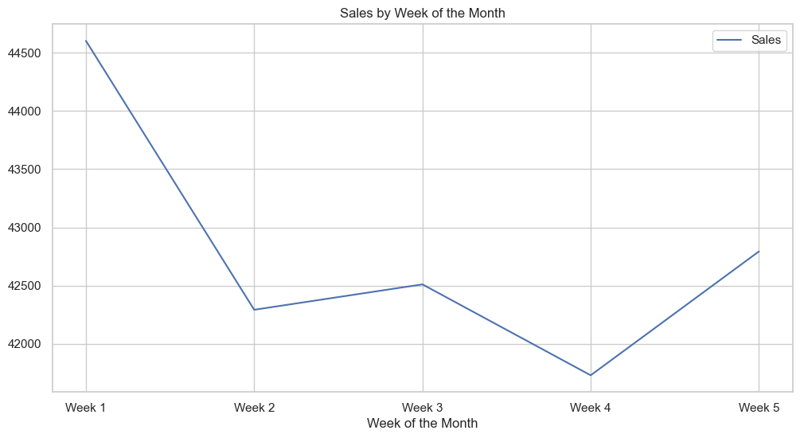
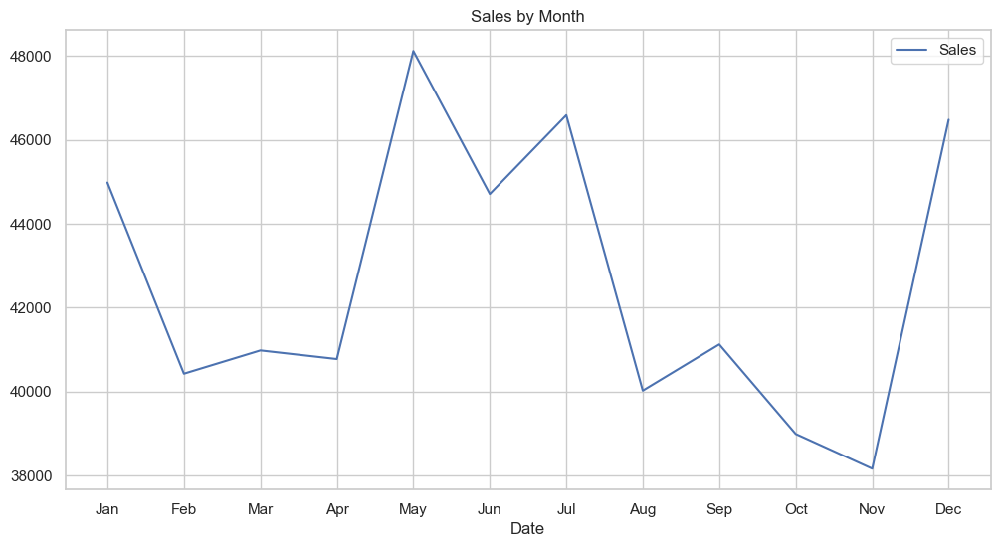

# Sales Forecasting Case Study


- [Sales Forecasting Case Study](#sales-forecasting-case-study)
  - [Introduction](#introduction)
  - [Process Flow](#process-flow)
  - [Data](#data)
  - [Data Sanity Check](#data-sanity-check)
  - [EDA](#eda)
    - [Uni-variate Analysis](#uni-variate-analysis)
      - [Order Count Distribution](#order-count-distribution)
      - [Sales Distribution](#sales-distribution)
      - [Top stores by Sales](#top-stores-by-sales)
      - [Stores in Each Region](#stores-in-each-region)
    - [Bi-variate Analysis](#bi-variate-analysis)
      - [Regions by Sales and Orders](#regions-by-sales-and-orders)
      - [Store by Sales and Orders](#store-by-sales-and-orders)
      - [Location by Sales and Orders](#location-by-sales-and-orders)
    - [Multi-variate Analysis](#multi-variate-analysis)
      - [Sales vs Orders by Store Type](#sales-vs-orders-by-store-type)
      - [Sales vs Orders by Location Type](#sales-vs-orders-by-location-type)
      - [Sales vs Orders by Region](#sales-vs-orders-by-region)
  - [Tableau Dashboard](#tableau-dashboard)
    - [Tableau Dashboard Insights](#tableau-dashboard-insights)
  - [Time Series Analysis](#time-series-analysis)
    - [Trend](#trend)
    - [Seasonality](#seasonality)
      - [Day of Week Seasonality](#day-of-week-seasonality)
      - [Day of the Month Seasonality](#day-of-the-month-seasonality)
      - [Week of the Month Seasonality](#week-of-the-month-seasonality)
      - [Monthly Seasonality](#monthly-seasonality)
  - [Hypothesis Testing](#hypothesis-testing)
    - [Impact of Discounts on Sales](#impact-of-discounts-on-sales)
    - [Effect of Holidays on Sales](#effect-of-holidays-on-sales)
    - [Sales Differences Across Store Types](#sales-differences-across-store-types)
    - [Regional Sales Variability](#regional-sales-variability)
    - [Correlation between Number of Orders and Sales](#correlation-between-number-of-orders-and-sales)
  - [Prediction and Forecasting](#prediction-and-forecasting)
    - [Machine Learning Models](#machine-learning-models)
      - [Metric](#metric)
      - [Forecasting Techniques](#forecasting-techniques)
      - [Feature Engineering](#feature-engineering)
      - [Plots](#plots)
    - [Time Series Models](#time-series-models)
      - [Feature Engineering](#feature-engineering-1)
      - [Metric](#metric-1)
      - [Plots](#plots-1)
    - [Hierarchical Forecasting](#hierarchical-forecasting)
  - [Hyperparameter Tuning](#hyperparameter-tuning)
    - [Optuna](#optuna)
    - [MLflow](#mlflow)
  - [Deployment](#deployment)
    - [Streamlit](#streamlit)
  - [Conclusion](#conclusion)

## Introduction

Imagine you run multiple retail stores. One day, you suddenly run out of your best-selling product because you didn't anticipate the high demand. Frustrating, right? That's where sales forecasting comes in handy. It helps you plan your inventory and manage resources efficiently, so you're always prepared for your customers' needs.

<Alert variant="info">
This is a very long blog, please use the "Table of Contents" to read a particular subtopic.
</Alert>

In the competitive retail industry, accurately predicting future sales is crucial for operational and strategic planning. Product sales forecasting aims to estimate the number of products a store will sell in the future, based on various influencing factors such as store type, location, regional characteristics, promotional activities, and temporal variations (such as holidays and seasons). This case study focuses on developing a predictive model that uses historical sales data from different stores to forecast sales for upcoming periods.

Effective sales forecasting is fundamental for multiple aspects of retail management and operation, including:

1. Inventory Management: Accurate sales forecasts help ensure that stores maintain optimal inventory levels—enough to meet customer demand without overstocking, which can lead to increased costs or waste, especially in the case of perishable goods.
1. Financial Planning: Forecasting sales allows businesses to estimate future revenue and manage budgets more effectively. This is crucial for allocating resources to areas such as marketing, staffing, and capital investments.
1. Marketing and Promotions: Understanding when sales peaks and troughs are likely to occur enables retailers to plan effective marketing campaigns and promotional offers to boost revenue or manage customer flow.
1. Supply Chain Optimization: Sales forecasts inform production schedules, logistics, and distribution plans, ensuring that products are available where and when they are needed, thereby reducing transportation and storage costs.
1. Strategic Decision Making: Long-term sales forecasting supports broader business strategies, including store expansions, market-entry, and other capital expenditures.

## Process Flow

1. **Data Collection**: The first step is to collect the data from the source. In this case, we have a dataset containing historical sales data for multiple stores.
2. **Exploratory Data Analysis (EDA)**: Next, we perform EDA to understand the data, identify patterns, and generate insights that can inform further analysis and modelling.
3. **Hypothesis Testing**: We test several hypotheses related to the sales data to determine whether certain factors have a significant impact on sales.
4. **Time Series Analysis**: We analyze the sales data to identify trends, seasonality, and other patterns that can help us forecast future sales.
5. **Feature Engineering**: We create new features from the existing data to improve the performance of our models.
6. **Machine Learning Models**: We build machine learning models to predict future sales based on historical data. We experiment with different algorithms and hyperparameters to find the best model.
7. **Deployment**: We deploy the best model on the cloud and serve it using APIs or web applications like Streamlit.
8. **Monitoring and Maintenance**: We monitor the model's performance and update it as needed to ensure accurate and reliable sales forecasting.
9. **Feedback Loop**: We collect feedback from users and stakeholders to improve the model and make it more effective over time.
10. **Documentation**: We document the entire process, including data sources, methodology, results, and insights, to ensure transparency and reproducibility.
11. **Presentation**: We present the analysis's findings and insights to stakeholders and decision-makers to inform strategic planning and decision-making.
12. **Actionable Insights**: Based on the analysis, we provide actionable insights and recommendations to help businesses optimize their operations and maximize sales.
13. **Future Scope**: We identify areas for further research and improvement to enhance the accuracy and effectiveness of the sales forecasting model.

## Data

1. ID: Unique identifier for each record in the dataset.
2. Store_id: Unique identifier for each store.
3. Store_Type: Categorization of the store based on its type.
4. Location_Type: Classification of the store's location (e.g., urban, suburban).
5. Region_Code: Code representing the geographical region where the store is located.
6. Date: The specific date on which the data was recorded.
7. Holiday: Indicator of whether the date was a holiday (1: Yes, 0: No).
8. Discount: Indicates whether a discount was offered on the given date (Yes/No).
9. Orders: The number of orders received by the store on the specified day.
10. Sales: Total sales amount for the store on the given day.

TODO: Add more details about the data variables and their importance

## Data Sanity Check

Before we start with the analysis, it is important to perform a data sanity check to ensure that the data is clean and consistent. This involves checking for missing values, duplicates, outliers, and other anomalies that could affect the quality of the analysis and modelling.

## EDA

EDA is an essential step in the data analysis process. It helps us understand the data, identify patterns, relationships, and anomalies, and generate insights that can inform further analysis and modelling. In this section, I will explore the sales data to gain a better understanding of the underlying patterns and trends.

If you feel adventurous, you can view the EDA notebook by clicking the badge below.

[](https://nbviewer.org/github/gautamnaik1994/SalesForecasting_ML_CaseStudy/blob/main/notebooks/eda/02.EDA.ipynb?flush_cache=true)

### Uni-variate Analysis

#### Order Count Distribution


**Observations:**

- We can see that most of the order count for each store is around 50 - 80

---

#### Sales Distribution


**Observations:**

- We can see that most of the sales are around 50000

---

#### Top stores by Sales


**Observations:**

- From the above plot we can see that Store 175 has the highest number of sales

---

#### Stores in Each Region


**Observations:**

- There are 124 stores in R1 region, 105 in R2, 86 in R3 and 50 stores in R4 region

### Bi-variate Analysis

#### Regions by Sales and Orders


**Observations:**

- We can see that Region R1 has the highest number of sales and orders
- Region R4 has the lowest number of sales and orders

---

#### Store by Sales and Orders



**Observations:**

- We can see that Store type S1 has the highest number of sales and orders
- Store type S2 has the lowest number of sales and orders

---

#### Location by Sales and Orders


**Observations:**

- We can see that Location type L1 has the highest number of sales and orders.
- Location type L4 has the lowest number of sales and orders.

---

### Multi-variate Analysis

#### Sales vs Orders by Store Type


**Observations:**

- From the above plot we can see a clear distribution of sales and orders by the store for each Store type

---

#### Sales vs Orders by Location Type


**Observations:**

- From the above plot we can see a clear distribution of sales and orders by store for each Location type

---

#### Sales vs Orders by Region


**Observations:**

- From the above plot, we can see there is no clear distribution of sales and orders by store for each Region

## Tableau Dashboard

Data scientists and analysts often work in Jupyter notebooks, where they create and test new features. This process generates code that non-technical stakeholders may find difficult to interpret.

To share this analysis with a wider audience, I have created an interactive Tableau dashboard that visualizes the sales data and provides user-friendly features for data exploration. This dashboard makes the insights gleaned from the EDA process more accessible and understandable to those without a technical background.

**Planning Tableau Dashboard**

Before starting the analysis, I created a outline of  Tableau dashboard to
visualize the data and identify key insights. This dashboard provides an
overview of the sales data, including sales by store type, location type, and
region, as well as trends over time. It also includes interactive filters and
drill-down capabilities to explore the data in more detail.


**Final Tableau Dashboard**

Click on the following badge to view the Tableau dashboard.

[](https://public.tableau.com/views/SalesForecasting_17373524705280/SalesForecasting?:showVizHome=no&:embed=true)

**Following is the embedded dashboard**

<iframe src="https://public.tableau.com/views/SalesForecasting_17373524705280/SalesForecasting?:showVizHome=no&:embed=true" frameborder="0"  height="900" allowfullscreen="true" mozallowfullscreen="true" webkitallowfullscreen="true" className="blog-wide-section"></iframe>

### Tableau Dashboard Insights

The dashboard reveals that sales data is stationary, lacking a significant upward or downward trend over time. However, the data does exhibit seasonal patterns, such as weekly and monthly seasonality. Additionally, sales volumes differ across various store types, location types, and regions.

## Time Series Analysis

Time series analysis is a statistical method used to analyze and forecast time-dependent data. It involves identifying patterns, trends, and seasonal variations in the data to make predictions about future values. In this section, I will perform a time series analysis of the sales data to identify trends, seasonality, and other patterns that can help us forecast future sales.

### Trend


<p class="text-center">Global Time Series</p>

As you can see from the above plot there is no clear trend in the data. The sales data is stationary and does not exhibit any significant upward or downward trend over time.


<p class="text-center">Plot of Seasonal Decompose</p>

### Seasonality

Have you ever wondered why some days your store is bustling with customers while other days it's eerily quiet? That's the magic of weekly seasonality. Understanding these patterns is crucial for retail businesses to optimize their operations and maximize sales

As with any sales data, multiple seasonal patterns are evident. The most important seasonal pattern is weekly seasonality. Weekends tend to have higher sales as compared to other days. The following plots showcase the different seasonal patterns present in the data.

#### Day of Week Seasonality



- Sales are highest during Saturday and Sunday
- This can be attributed to the fact that most people are off from work during the weekends and tend to shop more
- Business owners can leverage this information to plan promotions and marketing campaigns during the weekends

#### Day of the Month Seasonality


- There is a high number of sales during the first 5 days of the month
- This can be attributed to the fact that most people receive their salaries during the first week of the month
- Business owners can leverage this information to plan promotions and marketing campaigns during the first week of the month

#### Week of the Month Seasonality


- There is a higher number of sales during the first week of the month
- There is a slight increase in sales during the last week of the month
- The sales are lowest during the 4th week of the month

#### Monthly Seasonality



- Sales are highest during May, July, December, and January

## Hypothesis Testing

Hypothesis testing is a statistical method used to make inferences about a population based on sample data. It involves formulating a null hypothesis (H0) and an alternative hypothesis (H1) and using statistical tests to determine whether the sample data provides enough evidence to reject the null hypothesis in favour of the alternative hypothesis. In this section, I will test several hypotheses related to the sales data to determine whether certain factors have a significant impact on sales.

We will be using 0.05 as the significance level for all hypothesis tests. This means that we will reject the null hypothesis if the p-value is less than 0.05.

**Hypothesis Testing Explained**

Imagine you're the manager of a café, and you just introduced a new type of coffee. You claim, "This coffee will increase the average daily number of customers!" However, your sceptical friend says, "Maybe the number of customers is the same as before."

Here’s how you can use hypothesis testing to figure it out:

Start with two ideas (hypotheses):

- **Null Hypothesis (H₀)**: The new coffee doesn't change the number of customers.
- **Alternative Hypothesis (H₁)**: The new coffee increases the number of customers.

**Collect data:**
For a week, you track how many customers come in daily after introducing the new coffee. Let’s say the average used to be 100 customers per day.

**Do the math:**
A statistical test (like a t-test) will compare the new data to the old average of 100 customers. It calculates something called a p-value.

**Understand the p-value:**
The p-value is like a "chance meter." It shows how likely it is that what you're seeing (more customers) is just random luck if your new coffee doesn't actually make a difference.

- A small p-value (0.03) means it's probably not just luck—your coffee is likely making a difference!
- A large p-value (0.4) means it could easily be random, so there's no strong proof the coffee is helping.

**Make a decision:**
You choose a threshold (called significance level, often 0.05).

If the p-value is smaller than 0.05, you reject the null hypothesis and celebrate! 🎉
If not, you stick with the null hypothesis and reconsider your coffee strategy.

---

### Impact of Discounts on Sales

**Hypothesis:** Stores offering discounts will have significantly higher sales than stores not offering discounts.

- **Null Hypothesis:** Stores offering discounts will have the same sales as stores not offering discounts.
- **Alternative Hypothesis:** Stores offering discounts will have significantly higher sales than stores not offering discounts.

**Verdict:** Since the p-value is 0, we reject the null hypothesis and accept the alternative hypothesis. This means that stores offering discounts will have significantly higher sales than stores not offering discounts.

---

### Effect of Holidays on Sales

**Hypothesis:** Sales on holidays are higher compared to non-holidays.

- **Null Hypothesis:** Sales on holidays are the same as sales on non-holidays.
- **Alternative Hypothesis:** Sales on holidays are higher compared to non-holidays.

**Verdict:** Since the p-value is 1, we fail to reject the null hypothesis. This means that sales on holidays are the same as sales on non-holidays.

---

### Sales Differences Across Store Types

**Hypothesis:** Different store types experience different sales volumes.

- **Null Hypothesis:** Different store types experience the same sales volumes.
- **Alternative Hypothesis:** Different store types experience different sales volumes.

**Verdict:** Since the p-value is 0, we reject the null hypothesis and accept the alternative hypothesis. This means that different store types experience different sales volumes.

---

### Regional Sales Variability

**Hypothesis:** Different regions experience different sales volumes.

- **Null Hypothesis:** Different regions experience the same sales volumes.
- **Alternative Hypothesis:** Different regions experience different sales volumes.


**Observations:**

- From the Shapiro test and QQ plot, we can say that the data is not normally distributed. Hence, we will use a non-parametric test to check if the sales volumes are different across different regions.
- We will use the Kruskal-Wallis test to check if the sales volumes are different across different regions.

**Verdict:** Since the p-value for the Kruskal-Wallis test is 0, we reject the null hypothesis and conclude that different regions experience different sales volumes.

---

### Correlation between Number of Orders and Sales


**Observations:**

- From the above plot we can see that there is a positive correlation between the number of orders and sales. This means that as the number of orders increases, sales also increase.

## Prediction and Forecasting

Businesses rely on planning for success, which necessitates an understanding of future trends.  While past sales data has offered valuable insights, we will now utilize machine learning algorithms to predict future sales.

Traditional statistical and econometric models, while valuable in certain contexts, are often limited in their ability to capture the complexities and nuances of real-world sales data. These models typically assume fixed patterns and relationships, which may not always hold true in practice. Machine learning algorithms, on the other hand, are designed to learn and adapt from data, allowing them to identify and model even the most intricate patterns and trends.

In the context of sales forecasting, machine learning algorithms can be employed at various levels of granularity. For example, these algorithms can be used to generate store-level sales predictions, taking into account factors such as local market conditions, demographics, and competitor activity. At the regional or global level, statistical time series models may be more appropriate, as they can capture broader economic trends and seasonality effects.

By combining the strengths of machine learning algorithms and statistical time series models, businesses can develop robust and comprehensive sales forecasting systems. These systems can provide valuable insights into future sales patterns, enabling businesses to anticipate changes in demand, optimize inventory levels, and allocate resources effectively. Ultimately, the ability to accurately forecast sales can give businesses a significant competitive advantage, allowing them to stay ahead of the curve and achieve sustainable growth.

In the following sections, I will delve deeper into the models and forecasting techniques used in this project, as well as the metrics and feature engineering strategies employed to optimize the predictive performance.

### Machine Learning Models

TODO

- What specific historical data features are included in the dataset for sales forecasting?
- How are the machine learning models selected and evaluated for accuracy in the prediction process?
- What are the anticipated challenges in implementing the sales forecasting model in a real retail environment?

When utilizing Machine Learning (ML) algorithms for time series forecasting, it's essential to understand that the data cannot be used in its raw format. ML algorithms typically require training data structured as 'n' rows and 'm' columns, along with corresponding target data with 'n' rows and one or more columns, depending on the specific algorithm.

In the simplest time series forecasting scenario, today's data would serve as the training input, and the model would predict tomorrow's value as the target output. However, to enhance the model's ability to capture underlying patterns and trends within the time series data, it's common practice to utilize a window of past data. For instance, using the previous 30 days of data as input features allows the model to learn from recent historical behavior and make more informed predictions about future values.

This process of transforming time series data into a suitable format for ML algorithms often involves feature engineering techniques, such as creating lagged features, rolling window statistics, and incorporating time-based features like day of the week or month of the year. These additional features can provide valuable context and improve the model's predictive performance.

We will go into detail about this in the upcoming Feature Engineering section.

During my experiments, I tried various machine learning algorithms, including Linear Regression, Random Forest, XGBoost, and LightGBM, to forecast sales data.

- Linear Regression, while simple and interpretable, struggled to capture the complex patterns and non-linear relationships present in the data.
- Random Forest took a long time to train and was not as accurate as XGBoost and LightGBM.
- XGBoost, gave good results but was inconsistent in terms of duration of training. Sometimes it took a long time to train, and sometimes it was faster.
- LightGBM, on the other hand, consistently outperformed the other algorithms in terms of speed and accuracy. It provided almost similar MAE as XGBoost but was faster in training.

Eventually I settled on using LightGBM, a gradient boosting framework that is known for its speed, efficiency, and accuracy. LightGBM is particularly well-suited for large datasets and high-dimensional feature spaces, making it an ideal choice for time series forecasting tasks.

#### Metric

I used Mean Absolute Error (MAE) as the evaluation metric for the models. MAE is the average of the absolute differences between the predicted and actual values. It gives us an idea of how far off our predictions are from the actual values. The lower the MAE, the better the model's performance. The standard deviation of the sales was 18084, so an MAE between 5000 and 10000 was considered a good value.

#### Forecasting Techniques

When it comes to Forecasting techniques using ML algorithms there are multiple ways to forecast the sales data. Following are the techniques:

**Single-step Forecasting**  
Single-step forecasting is a forecasting technique that involves predicting one future time step at a time. In the context of this project, it would mean using the data from the previous 30 days to forecast the sales for the next day. This is a simple and straightforward approach that can be effective for short-term forecasting.

**Multi-step Forecasting**  
Multi-step forecasting is a forecasting technique that involves predicting multiple future time steps simultaneously. In the context of this project, it would mean using the data from the previous 30 days to forecast the sales for the next 7 days. This is a more advanced technique compared to single-step forecasting (predicting one time step ahead) and often requires additional feature engineering and more complex models. This can be done by training a separate model for each day ie. training a model for day 1, train another model for day 2 and so on. This is computationally expensive and not feasible for this project as it requires training and maintaining 7 models.

**Multi-output Forecasting**  
This is computationally less expensive compared to multi-step forecasting as we train a single model to predict multiple days in the future.
In the context of this project, it would mean using the data from the previous 30 days to forecast the sales for the next 7 days. This is a more advanced technique compared to single-step forecasting (predicting one time step ahead) and often requires additional feature engineering and more complex models. One can use MultiOuput Regressor from sklearn to implement this if the algorithm doesn't support multi-output forecasting natively.  
Here is the link to the documentation: [MultiOutput Regressor](https://scikit-learn.org/stable/modules/generated/sklearn.multioutput.MultiOutputRegressor.html)

**Recursive Forecasting**
Recursive forecasting is a methodology that utilizes historical data to predict future values. In this specific scenario, the model necessitates the data from the preceding 30 days to forecast the subsequent day's value.
This approach inherently limits the model's predictive capacity to a single day in advance. If a projection for multiple days in the future is required, the predicted value for the next day must be used as an input for the subsequent day's prediction, and this process is repeated for each successive day. This iterative process is known as recursion.
While recursive forecasting can be effective, it is essential to note that the accuracy of the predictions can degrade with each iteration. This is due to the fact that each prediction is based on a previous prediction, and any errors in the initial prediction will be compounded in subsequent predictions.
Therefore, while recursive forecasting can be a valuable tool for short-term forecasting, it may not be suitable for long-term forecasting due to the potential for accumulating errors.

#### Feature Engineering

**Lag Features**

From the time series analysis above I found that there are multiple seasonalities in the data. I used the 1-day lag, 7-day lag, 12-day lag and 30-day lag as features.
Using all the above lag values, I derived the following features:

1. Sales lag for each lag value
2. Rolling mean of Sales for each lag value
3. Rolling standard deviation of Sales for each lag value
4. Minimum and Maximum Sales in each lag period
5. Expanding weighted mean of Sales from the start of the data till the last available date
6. Expanding weighted standard deviation of Sales from the start of the data till the last available date
7. Expanding the weighted sum of Sales from the start of the data till the last available date

**Date Features**

1. Day of the week
1. Day of the month
1. Week of the month
1. Month
1. Quarter
1. Is Weekend

Since the above date features are cyclical, I used sin and cos
transformation to convert them into linear features. Doing this helps the model
to understand the cyclical nature of the features.
for eg.

```python
  df['Day_sin'] = np.sin(2 * np.pi * df['Day']/31)
  df['Day_cos'] = np.cos(2 * np.pi * df['Day']/31)
```

#### Plots

**Feature Importance**


- From the above plot we can see that the most important feature is the 1-day lag feature. This means that the sales on the previous day have the most impact on the sales for the current day.

**Actual vs. Predicted**


- From the above plot we can see that the model can predict the sales approximately. However, it couldn't predict the dips accurately.

**Residuals**


- From the above plot we can see that the residuals are normally distributed.

### Time Series Models

TODO describe time series models

**Triple Exponential Smoothing (Holt-Winters)**

This model uses a combination of three components: level, trend, and seasonality. It is suitable for time series data with a trend and seasonality. I used this model to forecast the global sales data and
region-level sales data.
I didn't want to use this model for store-level sales data as there were 365 stores and it would be computationally expensive to run this model for each store. It would also be tedious to maintain and deploy 365 models.

**Facebook Prophet**

Prophet is a forecasting tool developed by Facebook that is designed for analyzing time series data with daily observations that display patterns on different time scales. It is robust to missing data and shifts in the trend, and it provides intuitive parameters that are easy to interpret. I used this model to forecast the global sales data and region-level sales data.

#### Feature Engineering

#### Metric

I used Mean Absolute Percentage Error (MAPE) as the evaluation metric for the models.

#### Plots

1. Residuals
2. Actual vs. Predicted

### Hierarchical Forecasting

Hierarchical forecasting is a method used to forecast sales data at multiple levels of aggregation. In the context of this project, hierarchical forecasting can be used to predict sales at different levels of granularity, such as:

- Individual Store Level
- Region Level
- Global Level

Hierarchical forecasting is further divided into 3 main types:

1. **Top-Down Approach**: In this approach, the forecast for the highest level of aggregation (e.g., global sales) is generated first, and then the forecast is disaggregated to lower levels of aggregation (e.g., regional and store-level sales) based on historical proportions or other allocation methods.
2. **Bottom-Up Approach**: In this approach, the forecast for the lowest level of aggregation (e.g., individual store sales) is generated first, and then the forecast is aggregated to higher levels of aggregation (e.g., regional and global sales) based on the sum of the lower-level forecasts.
3. **Middle-Out Approach**: In this approach, the forecast for the middle level of aggregation (e.g., regional sales) is generated first, and then the forecast is disaggregated to lower levels of aggregation (e.g., individual store sales) and aggregated to higher levels of aggregation (e.g., global sales).

## Hyperparameter Tuning

Hyperparameter tuning is the process of finding the best hyperparameters for a
model. Grid Search and Random Search are the most common methods for
hyperparameter tuning. However, these methods are computationally expensive and
time-consuming. This is the reason, I chose [Optuna](https://optuna.org/) for hyperparameter tuning.
Along with Optuna, I used [MLflow](https://mlflow.org/) for tracking the experiments.
I have explained in detail about MLflow and Optuna in the next section.

### Optuna

Optuna is a hyperparameter optimization framework that uses
[Bayesian Optimization](https://en.wikipedia.org/wiki/Bayesian_optimization) to
find the best hyperparameters for a model. Optuna optionally saves information
about all the trails in a local SQLite database. It also provides a web UI to
visualize the trails. Using this web UI, we can compare different trails and also
show which hyperparameters are important.

Following are some screenshots of the Optuna UI:


<p class="text-center">Optuna Dashboard</p>


<p class="text-center">Hyperparameter Importance</p>

### MLflow

Whenever I work on ML projects, It quickly gets messy with multiple experiments, models,
and hyperparameters. Even the Jupyter Notebook gets cluttered with multiple
cells. This is where MLflow comes in. When set up correctly, MLflow can help you
track your experiments, models, and hyperparameters. It also helps you to log
the metrics, parameters, and artefacts. It also helps you to compare the
experiments and models. It also helps you to reproduce the results.

Following are some screenshots of the MLflow UI:


<p class="text-center">Dashboard</p>

## Deployment

### Streamlit


<p class="text-center">ML Pipeline</p>

[](https://sales-forecasting-gn.streamlit.app/)

## Conclusion
