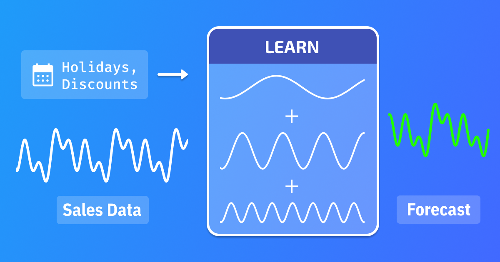

# Sales Forecasting Case Study



- [Sales Forecasting Case Study](#sales-forecasting-case-study)
  - [Introduction](#introduction)
  - [Data](#data)
  - [Tableau Dashboard](#tableau-dashboard)
  - [EDA](#eda)
    - [Uni-variate Analysis](#uni-variate-analysis)
      - [Order Count Distribution](#order-count-distribution)
      - [Sales Distribution](#sales-distribution)
      - [Top stores by Sales](#top-stores-by-sales)
      - [Stores in Each Region](#stores-in-each-region)
    - [Bi-variate Analysis](#bi-variate-analysis)
      - [Regions by Sales and Orders](#regions-by-sales-and-orders)
      - [Store by Sales and Orders](#store-by-sales-and-orders)
      - [Location by Sales and Orders](#location-by-sales-and-orders)
    - [Multi-variate Analysis](#multi-variate-analysis)
      - [Sales vs Orders by Store Type](#sales-vs-orders-by-store-type)
      - [Sales vs Orders by Location Type](#sales-vs-orders-by-location-type)
      - [Sales vs Orders by Region](#sales-vs-orders-by-region)
  - [Hypothesis Testing](#hypothesis-testing)
    - [Impact of Discounts on Sales](#impact-of-discounts-on-sales)
    - [Effect of Holidays on Sales](#effect-of-holidays-on-sales)
    - [Sales Differences Across Store](#sales-differences-across-store)
    - [Regional Sales Variability](#regional-sales-variability)
    - [Correlation between Number of Orders and Sales](#correlation-between-number-of-orders-and-sales)
  - [Time Series Analysis](#time-series-analysis)
    - [Trend](#trend)
    - [Seasonality](#seasonality)
      - [Day of Week Seasonality](#day-of-week-seasonality)
      - [Day of the Month Seasonality](#day-of-the-month-seasonality)
      - [Week of the Month Seasonality](#week-of-the-month-seasonality)
      - [Monthly Seasonality](#monthly-seasonality)
  - [Prediction and Forecasting](#prediction-and-forecasting)
    - [Machine Learning Models](#machine-learning-models)
      - [Forecasting Techniques](#forecasting-techniques)
      - [Metric](#metric)
      - [Feature Engineering](#feature-engineering)
    - [Plots](#plots)
    - [Time Series Models](#time-series-models)
      - [Feature Engineering](#feature-engineering-1)
      - [Metric](#metric-1)
    - [Plots](#plots-1)
  - [Hyperparameter Tuning](#hyperparameter-tuning)
    - [Optuna](#optuna)
    - [MLflow](#mlflow)
  - [Deployment](#deployment)
    - [Streamlit](#streamlit)
  - [Conclusion](#conclusion)

## Introduction

In the competitive retail industry, the ability to predict future sales accurately is crucial for operational and strategic planning. Product sales forecasting aims to estimate the number of products a store will sell in the future, based on various influencing factors such as store type, location, regional characteristics, promotional activities, and temporal variations (such as holidays and seasons). This project focuses on developing a predictive model that uses historical sales data from different stores to forecast sales for upcoming periods.

Effective sales forecasting is fundamental for multiple aspects of retail management and operation, including:

1. Inventory Management: Accurate sales forecasts help ensure that stores maintain optimal inventory levels—enough to meet customer demand without overstocking, which can lead to increased costs or waste, especially in the case of perishable goods.
1. Financial Planning: Forecasting sales allows businesses to estimate future revenue and manage budgets more effectively. This is crucial for allocating resources to areas such as marketing, staffing, and capital investments.
1. Marketing and Promotions: Understanding when sales peaks and troughs are likely to occur enables retailers to plan effective marketing campaigns and promotional offers to boost revenue or manage customer flow.
1. Supply Chain Optimization: Sales forecasts inform production schedules, logistics, and distribution plans, ensuring that products are available where and when they are needed, thereby reducing transportation and storage costs.
1. Strategic Decision Making: Long-term sales forecasting supports broader business strategies, including store expansions, market entry, and other capital expenditures.

## Data

1. ID: Unique identifier for each record in the dataset.
2. Store_id: Unique identifier for each store.
3. Store_Type: Categorization of the store based on its type.
4. Location_Type: Classification of the store's location (e.g., urban, suburban).
5. Region_Code: Code representing the geographical region where the store is located.
6. Date: The specific date on which the data was recorded.
7. Holiday: Indicator of whether the date was a holiday (1: Yes, 0: No).
8. Discount: Indicates whether a discount was offered on the given date (Yes/No).
9. Orders: The number of orders received by the store on the specified day.
10. Sales: Total sales amount for the store on the given day.

## Tableau Dashboard

**Planning Tableau Dashboard**


[](https://public.tableau.com/views/SalesForecasting_17373524705280/SalesForecasting?:showVizHome=no&:embed=true)

**Following is the embedded dashboard**

<iframe src="https://public.tableau.com/views/SalesForecasting_17373524705280/SalesForecasting?:showVizHome=no&:embed=true" frameborder="0"  height="900" allowfullscreen="true" mozallowfullscreen="true" webkitallowfullscreen="true" className="blog-wide-section"></iframe>

## EDA

EDA is an essential step in the data analysis process. It helps us understand the data, identify patterns, relationships, and anomalies, and generate insights that can inform further analysis and modeling. In this section, I will explore the sales data to gain a better understanding of the underlying patterns and trends.

If you feel adventurous, you can view the EDA notebook by clicking the badge below.

[](https://nbviewer.org/github/gautamnaik1994/SalesForecasting_ML_CaseStudy/blob/main/notebooks/eda/02.EDA.ipynb?flush_cache=true)

### Uni-variate Analysis

#### Order Count Distribution


**Observations:**

- We can see that most of the order count for each store is around 50 - 80

#### Sales Distribution


**Observations:**

- We can see that most of the sales are around 50000

#### Top stores by Sales


**Observations:**

- From above plot we can see that Store 175 has highest number of sales

#### Stores in Each Region


**Observations:**

- There are 124 stores in R1 region, 105 in R2, 86 in R3 and 50 stores in R4 region

### Bi-variate Analysis

#### Regions by Sales and Orders


**Observations:**

- We can see that Region R1 has the highest number of sales and orders
- Region R4 has the lowest number of sales and orders

#### Store by Sales and Orders


**Observations:**

- We can see that Store type S1 has the highest number of sales and orders
- Store type S2 has the lowest number of sales and orders

#### Location by Sales and Orders


**Observations:**

- We can see that Location type L1 has the highest number of sales and orders.
- Location type L4 has the lowest number of sales and orders.

### Multi-variate Analysis

#### Sales vs Orders by Store Type


**Observations:**

- From above plot we can see clear distribution of sales and orders by store for each Store type

#### Sales vs Orders by Location Type


**Observations:**

- From above plot we can see clear distribution of sales and orders by store for each Location type

#### Sales vs Orders by Region


**Observations:**

- From above plot we can see there is no clear distribution of sales and orders by store for each Region

## Hypothesis Testing

### Impact of Discounts on Sales

Hypothesis: Stores offering discounts will have significantly higher sales than stores not offering discounts

- **Null Hypothesis:** Stores offering discounts will have the same sales as stores not offering discounts
- **Alternative Hypothesis:** Stores offering discounts will have significantly higher sales than stores not offering discounts

Since p value is 0, it means we can reject the null hypothesis and accept the alternative hypothesis. This means that stores offering discounts will have significantly higher sales than stores not offering discounts.

### Effect of Holidays on Sales

Hypothesis: Sales on holidays are higher compared to non-holidays

- **Null Hypothesis:** Sales on holidays are the same as sales on non-holidays
- **Alternative Hypothesis:** Sales on holidays are higher compared to non-holidays

Since p value is 1, we fail to reject the null hypothesis. This means that sales on holidays are the same as sales on non-holidays.

### Sales Differences Across Store

Hypothesis: Different store types experience different sales volumes

- **Null Hypothesis:** Different store types experience the same sales volumes
- **Alternative Hypothesis:** Different store types experience different sales volumes

Since p value is 0, we can reject the null hypothesis and accept the alternative hypothesis. This means that different store types experience different sales volumes.

### Regional Sales Variability

Hypothesis: Different regions experience different sales volumes

- **Null Hypothesis:**  Different regions experience the same sales volumes
- **Alternative Hypothesis:** Different regions experience different sales volumes


**Observations:**

- From above shapiro test and qq plot we can say that the data is not normally distributed
- We will be using Kruskal-Wallis test to check if the sales volumes are different across different regions

Since p value for kruskal test is 0, we reject the null hypothesis and conclude that different regions experience different sales volumes.

### Correlation between Number of Orders and Sales


- From above plot we can see that there is a positive correlation between number of orders and sales. This means that as the number of orders increase, sales also increase.

## Time Series Analysis

### Trend

### Seasonality

As with any sales data, multiple seasonal patterns are evident. The most important seasonal pattern is weekly seasonality. Weekends tend to have higher sales as compared to other days. The following plots showcase the different seasonal patterns present in the data.

#### Day of Week Seasonality


- Sales are highest during Saturday and Sunday

#### Day of the Month Seasonality


- There is high number of sales during the 5 days of the month

#### Week of the Month Seasonality


- There is higher number of sales during the first week of the month
- There is a slight increase in sales during the last week of the month
- The sales is lowest during the 4th week of the month

#### Monthly Seasonality


- Sales are highest during the months of May, July, December, and January

## Prediction and Forecasting

Every business needs to plan ahead. Knowing what will happen in the future is key to a successful business. Up until now, we have been looking at past sales data for insights. We will leverage this information to predict future sales using different Machine Learning algorithms. Most time series forecasting has been done using statistical/econometric algorithms. These models work perfectly fine when the dataset has fixed patterns but fail to capture complex patterns and scenarios. That is why we will be using tree-based machine learning algorithms to predict each store's sales. We will also use statistical time series models to forecast larger region-level and global-level sales.

In the following sections, I will delve deeper into each technique.

### Machine Learning Models

When using ML algorithms, we cannot directly use the time series data. All ML algorithms accept training data of shape n rows with m columns and target data with n rows and 1 column. There are certain algorithms that accept target data with multiple columns.

At a bare minimum, we have to use today's data as training data and tomorrow's data as the target variable.

To properly capture the patterns, we will be using the previous 30 days of data. We will go into detail about this in the upcoming Feature Engineering section.

During my experiments I tried the following algorithms.

1. Linear Regression
1. Random Forest
1. XGBoost
1. LightGBM

Out of all above algorithms, LightGBM has the lowest MAE and least inference
time.

#### Forecasting Techniques

**Multi-step Forecasting**
In this technique, we will use the previous 30 days data to predict the next 7
days data. This is a more complex technique and requires more feature engineering.
As a future scope, I will be implementing this technique.

**Recursive Multi-step Forecasting**
Since this algorithms require previous 30 days data to predict next day data,
Our ML model will be able to predict only 1 day in future. To predict more than
1 day in future, we will have to use the predicted value as input for the next
day.

#### Metric

I used Mean Absolute Error (MAE) as the evaluation metric for the models.

#### Feature Engineering

**Lag Features**

From the time series analysis above I found that there are multiple seasonalities in the data. I used the 1 day lag, 7 day lag, 12 day lag and 30 day lag as features for the models.

Using all above lag values, I derived the following features:

1. Sales lag for each lag value
1. Rolling mean of Sales for each lag value
1. Rolling standard deviation of Sales for each lag value
1. Minimum and Maximum Sales in each lag period
1. Expanding weighted mean of Sales from the start of the data till the last available date
1. Expanding weighted standard deviation of Sales from the start of the data till the last available date
1. Expanding weighted sum of Sales from the start of the data till the last available date

**Date Features**

1. Day of the week
1. Day of the month
1. Week of the month
1. Month
1. Quarter
1. Is Weekend

Since above date features are cyclical in nature, I used sin and cos
transformation to convert them into linear features. Doing this helps the model
to understand the cyclical nature of the features.
for eg.

```python
  df['Day_sin'] = np.sin(2 * np.pi * df['Day']/31)
  df['Day_cos'] = np.cos(2 * np.pi * df['Day']/31)
```

### Plots

1. Feature Importance
1. Residuals
1. Actual vs. Predicted

### Time Series Models

1. Triple Exponential Smoothing (Holt-Winters)
1. ARIMA
1. SARIMA
1. SARIMAX
1. MSTLES

#### Feature Engineering

#### Metric

I used Mean Absolute Percentage Error (MAPE) as the evaluation metric for the models.

### Plots

1. Feature Importance
1. Residuals
1. Actual vs. Predicted

## Hyperparameter Tuning

Hyperparameter tuning is the process of finding the best hyperparameters for a
model. Grid Search and Random Search are the most common methods for
hyperparameter tuning. However, these methods are computationally expensive and
time-consuming.This is the reason, I chose [Optuna](https://optuna.org/) for hyperparameter tuning.
Along with Optuna, I used [MLflow](https://mlflow.org/) for tracking the experiments.
I have explained in detail about MLflow and Optuna in the next section.

### Optuna

Optuna is a hyperparameter optimization framework that uses
[Bayesian Optimization](https://en.wikipedia.org/wiki/Bayesian_optimization) to
find the best hyperparameters for a model. Optuna optially saves information
about all the trails in a local SQLite database. It also provides a web UI to
visualize the trails. Using this web UI, we can compare different trails and also
shows which hyperparameters are important.

Following are some screenshots of the Optuna UI:


<p class="text-center">Optuna Dashboard</p>


<p class="text-center">Hyperparameter Importance</p>

### MLflow

Whenever I work on ML projects, It quickly gets messy with multiple experiments, models,
and hyperparameters. Even the Jupyter notebook gets cluttered with multiple
cells. This is where MLflow comes in. When setup correctly, MLflow can help you
track your experiments, models, and hyperparameters. It also helps you to log
the metrics, parameters, and artifacts. It also helps you to compare the
experiments and models. It also helps you to reproduce the results.

Following are some screenshots of the MLflow UI:


<p class="text-center">Dashboard</p>

## Deployment

### Streamlit

TODO: Add pipeline architecture diagram

[](https://sales-forecasting-gn.streamlit.app/)

## Conclusion
